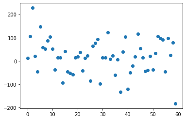
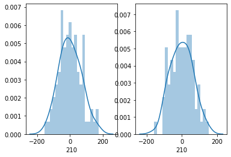
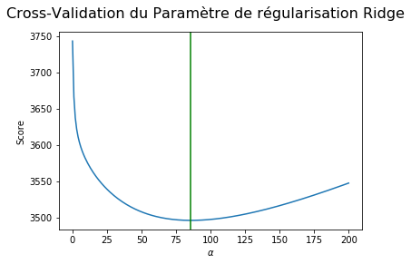

# Time Series Analysis


```python
import pandas as pd
import numpy as np
import seaborn as sns
import matplotlib.pyplot as plt
from scipy import signal
import math
import statsmodels.api as sm
from scipy import stats
from statsmodels.tsa.arima_model import ARIMA
from statsmodels.tsa.arima_model import ARMA
import datetime
from sklearn.metrics import mean_squared_error
import matplotlib.mlab as mlab
import math
from scipy.stats import norm
import statsmodels.graphics.tsaplots as tsa
from pandas.plotting import register_matplotlib_converters
register_matplotlib_converters()
%config InlineBackend.figure_format = 'retina'
```

# Données “Syndromes grippaux” 

1) Importez les données du fichier Openhealth_S-Grippal.csv. Consultez http://www.openhealth. fr/ias pour plus d’information sur les données. Affichez les 5 premières lignes du jeu de données. On va travailler seulement avec la variable IAS_brut, sous la forme d’une série temporelle, dont on précisera la fréquence d’échantillonage et les dates de début et de fin. Pour cette variable, dans ce jeu de données, les cas de nullité correspondent à des données manquantes. Combiende données manquantes comporte-t-elle? Pour les traitements des questions suivantes, éliminez les données manquantes par imputation, c’est-à-dire en déduisant une valeur plus “raisonnable” aux dates non- observées à partir des valeurs aux dates observées : par exemple par la moyenne de deux dates les plus proches.


```python
df = pd.read_csv("OpenhealthS-Grippal.csv", delimiter=";",
                 encoding="latin-1", decimal=",", na_values=0)
```


```python
df.tail()
```


<div>
<style scoped>
    .dataframe tbody tr th:only-of-type {
        vertical-align: middle;
    }

    .dataframe tbody tr th {
        vertical-align: top;
    }

    .dataframe thead th {
        text-align: right;
    }
</style>
<table border="1" class="dataframe">
  <thead>
    <tr style="text-align: right;">
      <th></th>
      <th>PERIODE</th>
      <th>IAS_brut</th>
      <th>IAS_lisse</th>
      <th>Incidence_Sentinelles</th>
    </tr>
  </thead>
  <tbody>
    <tr>
      <th>1747</th>
      <td>2014-04-13</td>
      <td>77.9</td>
      <td>1.8</td>
      <td>NaN</td>
    </tr>
    <tr>
      <th>1748</th>
      <td>2014-04-14</td>
      <td>2.7</td>
      <td>1.7</td>
      <td>NaN</td>
    </tr>
    <tr>
      <th>1749</th>
      <td>2014-04-15</td>
      <td>1.0</td>
      <td>1.6</td>
      <td>NaN</td>
    </tr>
    <tr>
      <th>1750</th>
      <td>2014-04-16</td>
      <td>1.6</td>
      <td>1.6</td>
      <td>NaN</td>
    </tr>
    <tr>
      <th>1751</th>
      <td>2014-04-17</td>
      <td>0.4</td>
      <td>1.6</td>
      <td>NaN</td>
    </tr>
  </tbody>
</table>
</div>


```python
df.describe()
```


<div>
<style scoped>
    .dataframe tbody tr th:only-of-type {
        vertical-align: middle;
    }

    .dataframe tbody tr th {
        vertical-align: top;
    }

    .dataframe thead th {
        text-align: right;
    }
</style>
<table border="1" class="dataframe">
  <thead>
    <tr style="text-align: right;">
      <th></th>
      <th>IAS_brut</th>
      <th>IAS_lisse</th>
      <th>Incidence_Sentinelles</th>
    </tr>
  </thead>
  <tbody>
    <tr>
      <th>count</th>
      <td>1744.000000</td>
      <td>1752.000000</td>
      <td>1734.000000</td>
    </tr>
    <tr>
      <th>mean</th>
      <td>316.680046</td>
      <td>34.805023</td>
      <td>13.536332</td>
    </tr>
    <tr>
      <th>std</th>
      <td>2752.169290</td>
      <td>101.589259</td>
      <td>22.547233</td>
    </tr>
    <tr>
      <th>min</th>
      <td>0.100000</td>
      <td>0.300000</td>
      <td>0.100000</td>
    </tr>
    <tr>
      <th>25%</th>
      <td>1.300000</td>
      <td>1.200000</td>
      <td>1.100000</td>
    </tr>
    <tr>
      <th>50%</th>
      <td>3.800000</td>
      <td>2.850000</td>
      <td>3.600000</td>
    </tr>
    <tr>
      <th>75%</th>
      <td>23.275000</td>
      <td>11.400000</td>
      <td>13.350000</td>
    </tr>
    <tr>
      <th>max</th>
      <td>71851.800000</td>
      <td>863.100000</td>
      <td>110.000000</td>
    </tr>
  </tbody>
</table>
</div>


```python
df['IAS_brut'].isnull().sum()
```


    8


Il y a 8 valeurs manquantes.


```python
#On choisi l'interpolation linéaire  pour les valeurs manquantes.
df['IAS_brut'] = df['IAS_brut'].interpolate(method='linear',axis=0)
```

2. Tracez la série temporelle considérée en fonction du temps. Commentez brièvement ce que vous observez.


```python
#transform to datastamps
df['PERIODE'] = pd.to_datetime(df['PERIODE'])
```


```python
type(df['PERIODE'])
```


    pandas.core.series.Series


```python
sns.set()
plt.figure(figsize=(15, 5))
plt.plot(df['PERIODE'].values, df['IAS_brut'].values)
plt.title("Série temporel - IAS Brut (2009-2014)")
plt.show()
```


<font style="color:Royalblue"> 
Il y a une périodité annuelle(sans doute lié avec le pic d'épidemie de la grippe en hiver). Cependant, le pic est moins prononcée pour 2014.


3. Tracez l’histogramme de la loi marginale. Quel impact la distribution observée par l’histogramme
a sur la trajectoire représentée à la question précédente ?


```python
sns.set()
plt.figure(figsize=(15, 8))
plt.subplot(2, 1, 1)
plt.hist(df['IAS_brut'], bins=400)
plt.xlabel('IAS Brut')
plt.ylabel('Frequence')
plt.title("Histogramme de IAS Brut")
```


    Text(0.5, 1.0, 'Histogramme de IAS Brut')


<font style="color:Royalblue"> 
Les pics avec grandes valeurs IAS sont de fréquences très faibles. Les valeurs de IAS sont plus souvent proches de 0. 

4. Reprenez les questions précédentes après tranformations des observations par le logarithme naturel.
Commentez.


```python
sns.set()
plt.figure(figsize=(15, 5))
# numpy.log is the natural logarithme
plt.plot(np.log(df['IAS_brut']))
plt.title("Série temporel - log(IAS Brut) - (2009-2014) ")
plt.show()
```


```python
sns.set()
plt.figure(figsize=(15, 5))
plt.hist(np.log(df['IAS_brut']), bins=100)
plt.title("Histogramme de l'IAS Logarithmisé")
plt.xlabel('IAS logarithmisé(népérien)')
plt.ylabel('Frequence')
plt.show()
# log(IAS Brut)<0 quand IAS Brut <1
```


<font style="color:Royalblue"> 
Un axe logarithmique comprime l'échelle de manière non linéaire,les grands valeurs de IAS sont comprimés, rapprochés de 1, en revanche les valeurs inférieurs à 1 sont dilatés et  renvoyés vers l'infini négatif.
    
Cela signifie que des bacs de largeur variable doivent être utilisés pour les histogrammes. Ici on utilise toujours des bacs de largeur fix, ce qui permets de raprocher la 'longue queue à droite' vers 1 afin de mieux visualiser.


5. 
En utilisant signal.perodogram() (du package signal importé depuis scipy), tracez le périodo- gramme des données. Expliquez les pics les plus significatifs que vous observez. Attention au fait que dans la communauté signal les spectres sont normalisées pour des fréquences absolues dans [−1/2, 1/2] plutôt que [−π, −π].


```python
sns.set()
plt.figure(figsize=(15, 10))
plt.subplot(2, 1, 1)
# f : ndarray : Array of sample frequencies.
# Pxx : ndarray :Power spectral density or power spectrum of x.
f, Pxx_den = signal.periodogram(np.log(df['IAS_brut']), scaling='density')
plt.plot(f, Pxx_den)
# plt.xlabel('frequency')
plt.axvline(x=1/7, c='y', linestyle=':')
plt.axvline(x=1/3.5, c='y', linestyle=':')
plt.axvline(x=3/7, c='y', linestyle=':')
plt.axvline(x=1/365, c='y', linestyle=':')
plt.text(1/250, 1500, 'f=1/365')
plt.text(1/6.6, 1500, 'f=1/7')
plt.ylabel('power spectral density (PSD) , scaling=density')
plt.title('Periodogram with raw IAS data and logarithmized IAS data')

plt.subplot(2, 1, 2)
f, Pxx_den = signal.periodogram(np.log(df['IAS_brut']), scaling='density')
plt.plot(f, Pxx_den)
# This is just a thin wrapper around plot which additionally changes the y-axis to log scaling.
plt.semilogy(f, Pxx_den)
# https://matplotlib.org/3.1.1/api/_as_gen/matplotlib.pyplot.semilogy.html
plt.ylim(10e-5,)
plt.axvline(x=1/7, c='y', linestyle=':')
plt.axvline(x=1/3.5, c='y', linestyle=':')
plt.axvline(x=3/7, c='y', linestyle=':')
plt.axvline(x=1/365, c='y', linestyle=':')
plt.text(1/250, 1500, 'f=1/365')
plt.text(1/6.6, 1500, 'f=1/7')
plt.xlabel('frequency [1/n_jour]')
plt.ylabel('power spectral density (PSD) ')
plt.show()
```


<font style="color:Royalblue"> 
Le périodogramme est une estimation de la densité spectrale d'un signal. Les pics sur le périodogramme montres les fréquences les plus importantes/dense. Cela corresponds avec les périodicités/saisonnalités les plus significatives.  


```python
# show the first peak
sns.set()
plt.figure(figsize=(15, 4))
f, Pxx_den = signal.periodogram(np.log(df['IAS_brut']), scaling='density')
plt.plot(f, Pxx_den)
plt.axvline(x=1/350, c='r', linestyle=':')
plt.xlim([1/1000, 1/40])
plt.text(1/250, 1500, 'f=1/365')

plt.xlabel('frequency [Hz]')
plt.ylabel('Linear spectrum [V RMS]')
plt.show()
```


<font style="color:Royalblue"> 
Le permier pic corresponds à la fréquence de 1/365.

6. Pour supprimer une tendance périodique de période T dans un signal (xt)t∈Z il suffit d’appliquer
le filtre ∆T défini par
[∆T x]t = xt − xt−T
Utilisez cette méthode pour supprimer la tendance périodique de période 1 an. Quel pic du périodogramme cette méthode a fait disparaître ?


```python
# On supprime l'autocorrélation annuelle
time_diff = []
for i in range(365, len(df)):
    time_diff.append(np.log(df.loc[i]['IAS_brut']) -
                     np.log(df.loc[i-365]['IAS_brut']))

sns.set()
plt.figure(figsize=(15, 5))
plt.plot(time_diff)
plt.text(1/250, 5, 'f=1/365')
plt.title(
    "Logarithmized IAS data with annual periodicity eliminated : serie X(t)-X(t-365) :")
plt.show()
```


```python
# periodogram with previous data
sns.set()
plt.figure(figsize=(15, 10))
plt.subplot(2, 1, 1)
f, Pxx_den = signal.periodogram(time_diff)
plt.plot(f, Pxx_den)
plt.axvline(x=1/7, c='y', linestyle=':')
plt.axvline(x=1/3.5, c='y', linestyle=':')
plt.axvline(x=3/7, c='y', linestyle=':')
plt.axvline(x=1/365, c='y', linestyle=':')
plt.ylim(10e-5,)
plt.text(1/250, 600, 'f=1/365')
plt.text(1/6.6, 600, 'f=1/7')
plt.xlabel('frequency [1/n_jour]')
plt.ylabel('PSD ')

plt.subplot(2, 1, 2)
plt.semilogy(f, Pxx_den)
plt.axvline(x=1/7, c='y', linestyle=':')
plt.axvline(x=1/3.5, c='y', linestyle=':')
plt.axvline(x=3/7, c='y', linestyle=':')
plt.axvline(x=1/365, c='y', linestyle=':')
plt.ylim(10e-5,)
plt.text(1/250, 600, 'f=1/365')
plt.text(1/6.6, 600, 'f=1/7')
plt.xlabel('frequency [1/n_jour]')
plt.ylabel('PSD ')
plt.show()
```


<font style="color:Royalblue"> 
Cette méthode a fait disparaitre le pic du périodogramme sur 1/365.
Le plus grand pic maintenant corresponds aux Fréquence 1/3.5, 3/7,1/7.


7. On vous propose un exercise de prédiction uniquement à partir de la tendance périodique. On va
prédire les valeurs de IAS_brut pour les dates du 1er avril 2013 au 17 avril 2014 en se basant
sur les observations précédentes (du 1er juillet 2009 au 31 mars 2013) pour estimer la tendance
périodique des données. Pour cela, pour un nombre d’harmoniques fixé (disons n_harm), construisez
les variables explicatives pour la période d’apprentissage : pour chaque k = 1, 2, ... n_harm, ajoutez
deux variables explicatives, xi,2k−1 = cos(ti · k · 2π ) et xi,2k = sin(ti · k · 2π ), où ti est le moment TT
de temps (on peut utiliser les nombres entiers au lieu de dates) et T = 365. Estimez la tendance périodique en régressant les données d’apprentissage sur ces variables explicatives.

Avec ce modèle linéaire, prédisez les valeurs du variable IAS_brut pour la période du 1er avril 2013 au 17 avril 2014.
Tracez les valeur de la série temporelle et votre prédiction pour l’ensemble de données (vous pouvez utilisez les couleurs différentes pour pour les partie apprentissage et prédiction). 
Puis, donnez le risque quadratique de la prédiction et tracez les résidus pour la période prédite.
Essayez les valeur de n_harm pour voir comment varie le risque quadratique de la prédiction.


```python
# We will try with raw IAS data and logarithmized IAS data
X = df.copy()
X = X.drop(['IAS_lisse', 'Incidence_Sentinelles'], axis=1)
X['IAS_log'] = np.log(X['IAS_brut'])
X['index'] = X.index
X.head()
```


<div>
<style scoped>
    .dataframe tbody tr th:only-of-type {
        vertical-align: middle;
    }

    .dataframe tbody tr th {
        vertical-align: top;
    }

    .dataframe thead th {
        text-align: right;
    }
</style>
<table border="1" class="dataframe">
  <thead>
    <tr style="text-align: right;">
      <th></th>
      <th>PERIODE</th>
      <th>IAS_brut</th>
      <th>IAS_log</th>
      <th>index</th>
    </tr>
  </thead>
  <tbody>
    <tr>
      <th>0</th>
      <td>2009-07-01</td>
      <td>1.7</td>
      <td>0.530628</td>
      <td>0</td>
    </tr>
    <tr>
      <th>1</th>
      <td>2009-07-02</td>
      <td>3.4</td>
      <td>1.223775</td>
      <td>1</td>
    </tr>
    <tr>
      <th>2</th>
      <td>2009-07-03</td>
      <td>2.1</td>
      <td>0.741937</td>
      <td>2</td>
    </tr>
    <tr>
      <th>3</th>
      <td>2009-07-04</td>
      <td>1.3</td>
      <td>0.262364</td>
      <td>3</td>
    </tr>
    <tr>
      <th>4</th>
      <td>2009-07-05</td>
      <td>14.2</td>
      <td>2.653242</td>
      <td>4</td>
    </tr>
  </tbody>
</table>
</div>


```python
# try a number of harmonics
n_harm = 5

# make 2*n_harm features
for k in range(1, 2*n_harm, 2):
    X['cos' + str(k)] = np.cos(X['index'] * (k * 2 * math.pi / 365))
    k += 1
    X['sin' + str(k)] = np.sin(X['index'] * (k * 2 * math.pi / 365))
```


```python
# features: 2n harmonics ,  label1: IAS_brut , label2:IAS_log
X.head()
```


<div>
<style scoped>
    .dataframe tbody tr th:only-of-type {
        vertical-align: middle;
    }

    .dataframe tbody tr th {
        vertical-align: top;
    }

    .dataframe thead th {
        text-align: right;
    }
</style>
<table border="1" class="dataframe">
  <thead>
    <tr style="text-align: right;">
      <th></th>
      <th>PERIODE</th>
      <th>IAS_brut</th>
      <th>IAS_log</th>
      <th>index</th>
      <th>cos1</th>
      <th>sin2</th>
      <th>cos3</th>
      <th>sin4</th>
      <th>cos5</th>
      <th>sin6</th>
      <th>cos7</th>
      <th>sin8</th>
      <th>cos9</th>
      <th>sin10</th>
    </tr>
  </thead>
  <tbody>
    <tr>
      <th>0</th>
      <td>2009-07-01</td>
      <td>1.7</td>
      <td>0.530628</td>
      <td>0</td>
      <td>1.000000</td>
      <td>0.000000</td>
      <td>1.000000</td>
      <td>0.000000</td>
      <td>1.000000</td>
      <td>0.000000</td>
      <td>1.000000</td>
      <td>0.000000</td>
      <td>1.000000</td>
      <td>0.000000</td>
    </tr>
    <tr>
      <th>1</th>
      <td>2009-07-02</td>
      <td>3.4</td>
      <td>1.223775</td>
      <td>1</td>
      <td>0.999852</td>
      <td>0.034422</td>
      <td>0.998667</td>
      <td>0.068802</td>
      <td>0.996298</td>
      <td>0.103102</td>
      <td>0.992749</td>
      <td>0.137279</td>
      <td>0.988023</td>
      <td>0.171293</td>
    </tr>
    <tr>
      <th>2</th>
      <td>2009-07-03</td>
      <td>2.1</td>
      <td>0.741937</td>
      <td>2</td>
      <td>0.999407</td>
      <td>0.068802</td>
      <td>0.994671</td>
      <td>0.137279</td>
      <td>0.985220</td>
      <td>0.205104</td>
      <td>0.971100</td>
      <td>0.271958</td>
      <td>0.952378</td>
      <td>0.337523</td>
    </tr>
    <tr>
      <th>3</th>
      <td>2009-07-04</td>
      <td>1.3</td>
      <td>0.262364</td>
      <td>3</td>
      <td>0.998667</td>
      <td>0.103102</td>
      <td>0.988023</td>
      <td>0.205104</td>
      <td>0.966848</td>
      <td>0.304921</td>
      <td>0.935368</td>
      <td>0.401488</td>
      <td>0.893919</td>
      <td>0.493776</td>
    </tr>
    <tr>
      <th>4</th>
      <td>2009-07-05</td>
      <td>14.2</td>
      <td>2.653242</td>
      <td>4</td>
      <td>0.997630</td>
      <td>0.137279</td>
      <td>0.978740</td>
      <td>0.271958</td>
      <td>0.941317</td>
      <td>0.401488</td>
      <td>0.886071</td>
      <td>0.523416</td>
      <td>0.814046</td>
      <td>0.635432</td>
    </tr>
  </tbody>
</table>
</div>


```python
#  just show some harmonics
sns.set()
plt.figure(figsize=(15, 4))
plt.plot(X['cos1'])
plt.plot(X['sin2'])
plt.plot(X['cos3'], alpha=0.3)
plt.plot(X['cos5'], alpha=0.3)
```


    [<matplotlib.lines.Line2D at 0x1c173ec908>]


```python
#chose training data (time periode) and test data
X_train = X[X['PERIODE'] <= "2013-03-31"]
X_test = X[X['PERIODE'] > "2013-03-31"]
```


```python
y_train = X_train['IAS_brut']
X_train = X_train.drop(['IAS_brut', 'IAS_log','PERIODE'], axis=1)

y_test = X_test['IAS_brut']
X_test = X_test.drop(['PERIODE', 'IAS_log','IAS_brut'], axis = 1)
X_train.head()
```


<div>
<style scoped>
    .dataframe tbody tr th:only-of-type {
        vertical-align: middle;
    }

    .dataframe tbody tr th {
        vertical-align: top;
    }

    .dataframe thead th {
        text-align: right;
    }
</style>
<table border="1" class="dataframe">
  <thead>
    <tr style="text-align: right;">
      <th></th>
      <th>index</th>
      <th>cos1</th>
      <th>sin2</th>
      <th>cos3</th>
      <th>sin4</th>
      <th>cos5</th>
      <th>sin6</th>
      <th>cos7</th>
      <th>sin8</th>
      <th>cos9</th>
      <th>sin10</th>
    </tr>
  </thead>
  <tbody>
    <tr>
      <th>0</th>
      <td>0</td>
      <td>1.000000</td>
      <td>0.000000</td>
      <td>1.000000</td>
      <td>0.000000</td>
      <td>1.000000</td>
      <td>0.000000</td>
      <td>1.000000</td>
      <td>0.000000</td>
      <td>1.000000</td>
      <td>0.000000</td>
    </tr>
    <tr>
      <th>1</th>
      <td>1</td>
      <td>0.999852</td>
      <td>0.034422</td>
      <td>0.998667</td>
      <td>0.068802</td>
      <td>0.996298</td>
      <td>0.103102</td>
      <td>0.992749</td>
      <td>0.137279</td>
      <td>0.988023</td>
      <td>0.171293</td>
    </tr>
    <tr>
      <th>2</th>
      <td>2</td>
      <td>0.999407</td>
      <td>0.068802</td>
      <td>0.994671</td>
      <td>0.137279</td>
      <td>0.985220</td>
      <td>0.205104</td>
      <td>0.971100</td>
      <td>0.271958</td>
      <td>0.952378</td>
      <td>0.337523</td>
    </tr>
    <tr>
      <th>3</th>
      <td>3</td>
      <td>0.998667</td>
      <td>0.103102</td>
      <td>0.988023</td>
      <td>0.205104</td>
      <td>0.966848</td>
      <td>0.304921</td>
      <td>0.935368</td>
      <td>0.401488</td>
      <td>0.893919</td>
      <td>0.493776</td>
    </tr>
    <tr>
      <th>4</th>
      <td>4</td>
      <td>0.997630</td>
      <td>0.137279</td>
      <td>0.978740</td>
      <td>0.271958</td>
      <td>0.941317</td>
      <td>0.401488</td>
      <td>0.886071</td>
      <td>0.523416</td>
      <td>0.814046</td>
      <td>0.635432</td>
    </tr>
  </tbody>
</table>
</div>


Estimez la tendance périodique en régressant les données d’apprentissage sur ces variables explicatives.


```python
X_train_pred = X_train.copy()
```


```python
X_train_pred.head()
```


<div>
<style scoped>
    .dataframe tbody tr th:only-of-type {
        vertical-align: middle;
    }

    .dataframe tbody tr th {
        vertical-align: top;
    }

    .dataframe thead th {
        text-align: right;
    }
</style>
<table border="1" class="dataframe">
  <thead>
    <tr style="text-align: right;">
      <th></th>
      <th>index</th>
      <th>cos1</th>
      <th>sin2</th>
      <th>cos3</th>
      <th>sin4</th>
      <th>cos5</th>
      <th>sin6</th>
      <th>cos7</th>
      <th>sin8</th>
      <th>cos9</th>
      <th>sin10</th>
    </tr>
  </thead>
  <tbody>
    <tr>
      <th>0</th>
      <td>0</td>
      <td>1.000000</td>
      <td>0.000000</td>
      <td>1.000000</td>
      <td>0.000000</td>
      <td>1.000000</td>
      <td>0.000000</td>
      <td>1.000000</td>
      <td>0.000000</td>
      <td>1.000000</td>
      <td>0.000000</td>
    </tr>
    <tr>
      <th>1</th>
      <td>1</td>
      <td>0.999852</td>
      <td>0.034422</td>
      <td>0.998667</td>
      <td>0.068802</td>
      <td>0.996298</td>
      <td>0.103102</td>
      <td>0.992749</td>
      <td>0.137279</td>
      <td>0.988023</td>
      <td>0.171293</td>
    </tr>
    <tr>
      <th>2</th>
      <td>2</td>
      <td>0.999407</td>
      <td>0.068802</td>
      <td>0.994671</td>
      <td>0.137279</td>
      <td>0.985220</td>
      <td>0.205104</td>
      <td>0.971100</td>
      <td>0.271958</td>
      <td>0.952378</td>
      <td>0.337523</td>
    </tr>
    <tr>
      <th>3</th>
      <td>3</td>
      <td>0.998667</td>
      <td>0.103102</td>
      <td>0.988023</td>
      <td>0.205104</td>
      <td>0.966848</td>
      <td>0.304921</td>
      <td>0.935368</td>
      <td>0.401488</td>
      <td>0.893919</td>
      <td>0.493776</td>
    </tr>
    <tr>
      <th>4</th>
      <td>4</td>
      <td>0.997630</td>
      <td>0.137279</td>
      <td>0.978740</td>
      <td>0.271958</td>
      <td>0.941317</td>
      <td>0.401488</td>
      <td>0.886071</td>
      <td>0.523416</td>
      <td>0.814046</td>
      <td>0.635432</td>
    </tr>
  </tbody>
</table>
</div>


```python
# use linear regression
# the features are harmonics , label is IAS data
from sklearn.linear_model import LinearRegression

reg = LinearRegression().fit(X_train, y_train)
pred = reg.predict(X_test)
X_train_fit = reg.predict(X_train)

print('The weights of intercept and the features(harmonics):')
print(reg.coef_)
```

    The weights of intercept and the features(harmonics):
    [ 2.97597104e-01 -5.48213297e+02  3.80046791e+02  9.45722945e+01
      5.50231412e+01  1.03784280e+02 -1.61630047e+02 -2.95835718e+02
      1.16577290e+02 -1.17099138e+02  7.46308105e+01]


```python
# Calculate the fitting curve on training data
X_train_pred = X_train.copy()
X_train_pred = X_train_pred.drop(['index'], axis=1)
X_train_pred.insert(loc=0, column='intercept', value=reg.intercept_)
for i in range(len(reg.coef_)):
    # print(X_train_pred.iloc[0,i],reg.coef_[i])
    X_train_pred.iloc[:, i] = X_train_pred.iloc[:, i]*reg.coef_[i]
X_train_pred.insert(loc=len(reg.coef_), column='pred', value=0)

for i in range(len(reg.coef_)):
    # print(i,X_train_pred.iloc[0,i])
    X_train_pred['pred'] = X_train_pred['pred']+X_train_pred.iloc[:, i]

# show the first Harmonics(features) with weights
sns.set()
plt.figure(figsize=(16, 6))
plt.plot(X_train_pred['cos1'], label='harmonic with annual periocity')
plt.plot(X_train_pred['sin2'], label='harmonic p=365/2', alpha=0.6)
plt.plot(X_train_pred['cos3'], alpha=0.3)
plt.plot(X_train_pred['sin4'], alpha=0.3)
# plt.plot(X_train_pred['cos5'],alpha=0.3)
# plt.plot(X_train_pred['sin6'],alpha=0.3)
plt.ylabel('IAS_brut')
plt.plot(X_train_pred['pred'], label='global fitting curve', color='r')
plt.legend()
```


    <matplotlib.legend.Legend at 0x1c18aaaeb8>





<font style="color:Royalblue"> 

Le plus grand poids (-5.48213297e+02) est sur l'harmonique blue cos(2*pi/365) : périodicité annuelle. C'est l'harmonique la plus importante, cela corrésponds tout à fait avec la question 5 et l'analyse sur la périodogram.


Avec ce modèle linéaire, prédisez les valeurs du variable IAS_brut pour la période du 1er avril 2013
au 17 avril 2014.


```python
# show the sum of all weighted variables
# compare with the real historic data
sns.set()
plt.figure(figsize=(15, 5))
#plt.plot(X_train['index'],X_train_pred['pred'],label='fit on train data')
plt.plot(X_train['index'], X_train_fit)
plt.plot(X_train['index'], y_train)
plt.plot(X_test['index'], pred, label='prediction')
plt.plot(X_test['index'], y_test, label='test')
plt.legend()
plt.show()
```


Donnez le risque quadratique de la prédiction et tracez les résidus pour la période prédite.
Essayez les valeur de n_harm pour voir comment varie le risque quadratique de la prédiction.


```python
residus_brut = pred - y_test
quad_risk = sum((y_test - pred)**2)
quad_risk
plt.figure(figsize=(16, 4))
plt.plot(residus_brut, label='résidus with raw IAS data')
plt.ylabel('résidus')
plt.legend()
```


    <matplotlib.legend.Legend at 0x1c1ae73208>





<font style="color:Royalblue"> 
Avec 10 harmoniques(features), le modèle prédicte assez bien.


```python
# with large n_harm, the model will overfit
n_harm = 500

X = df.copy()
X = X.drop(['IAS_lisse', 'Incidence_Sentinelles'], axis=1)
X['IAS_log'] = np.log(X['IAS_brut'])
X['index'] = X.index

for k in range(1, 2*n_harm, 2):
    X['cos' + str(k)] = np.cos(X['index'] * (k * 2 * math.pi / 365))
    k += 1
    X['sin' + str(k)] = np.sin(X['index'] * (k * 2 * math.pi / 365))

X_train = X[X['PERIODE'] <= "2013-03-31"]
X_test = X[X['PERIODE'] > "2013-03-31"]

y_train = X_train['IAS_brut']
X_train = X_train.drop(['IAS_brut', 'IAS_log', 'PERIODE'], axis=1)
y_test = X_test['IAS_brut']
X_test = X_test.drop(['PERIODE', 'IAS_log', 'IAS_brut'], axis=1)

# Linear Regression
reg = LinearRegression().fit(X_train, y_train)
reg.score(X_train, y_train)
pred = reg.predict(X_test)
X_train_fit = reg.predict(X_train)

sns.set()
plt.figure(figsize=(16, 6))
plt.plot(y_train, label="TrainingData")
plt.plot(X_train['index'], X_train_fit, alpha=0.5, label="Fit on TrainingData")
plt.plot(X_test['index'], pred, label="Prediction", alpha=0.5)
plt.plot(X_test['index'], y_test)  # label="TestData"
plt.legend()
plt.show()
```


<font style="color:Royalblue"> 
Avec large nombre de harmoniques(features), 500 par example, le modèle rencontre le problème de 'overfitting'/surapprendissage. Le risque empirique dimimue alors que le risque de généralisation augemente. Ce problème est particulièrement grave ici puisque il y a des valeurs extremes.


```python
# Test with logarithmized data

n_harm = 500
X = df.copy()
X = X.drop(['IAS_lisse', 'Incidence_Sentinelles'], axis=1)
X['IAS_log'] = np.log(X['IAS_brut'])
X['index'] = X.index

for k in range(1, 2*n_harm, 2):
    X['cos' + str(k)] = np.cos(X['index'] * (k * 2 * math.pi / 365))
    k += 1
    X['sin' + str(k)] = np.sin(X['index'] * (k * 2 * math.pi / 365))

X_train = X[X['PERIODE'] <= "2013-03-31"]
X_test = X[X['PERIODE'] > "2013-03-31"]

y_train = X_train['IAS_log']
X_train = X_train.drop(['IAS_brut', 'IAS_log', 'PERIODE'], axis=1)

y_test = X_test['IAS_log']
X_test = X_test.drop(['PERIODE', 'IAS_log', 'IAS_brut'], axis=1)

# Linear Regression
reg = LinearRegression().fit(X_train, y_train)
reg.score(X_train, y_train)
# reg.coef_
# reg.intercept_
pred = reg.predict(X_test)
X_train_fit = reg.predict(X_train)

plt.figure(figsize=(16, 6))
plt.plot(X_train['index'], y_train, label="TrainingData")
plt.plot(X_train['index'], X_train_fit, alpha=0.5, label="Fit on TrainingData")
plt.plot(X_test['index'], pred, label="Prediction", alpha=0.5)
plt.plot(X_test['index'], y_test)  # label="TestData"
plt.legend()
plt.show()
```


<font style="color:Royalblue"> 
Un essaie avec données logarithmisés. On obtient moins de surapprendissage. 


```python
# make a loop to calculate the Square Error with different n_harmonique
residus_brut = []
residus_log = []
quad_risk_brut = []
quad_risk_log = []
n_harmonique = []
for n_harm in range(1, 100, 3):
    n_harmonique.append(n_harm)
    X = df.copy()
    X = X.drop(['IAS_lisse', 'Incidence_Sentinelles'], axis=1)
    X['IAS_log'] = np.log(X['IAS_brut'])
    X['index'] = X.index

    for k in range(1, 2*n_harm, 2):
        X['cos' + str(k)] = np.cos(X['index'] * (k * 2 * math.pi / 365))
        k += 1
        X['sin' + str(k)] = np.sin(X['index'] * (k * 2 * math.pi / 365))

    # use raw IAS data and logarithmized IAS data
    X_train = X[X['PERIODE'] <= "2013-03-31"]
    X_test = X[X['PERIODE'] > "2013-03-31"]
    y_train_brut = X_train['IAS_brut']
    y_train_log = X_train['IAS_log']
    X_train = X_train.drop(['IAS_brut', 'PERIODE', 'IAS_log'], axis=1)
    y_test_brut = X_test['IAS_brut']
    y_test_log = X_test['IAS_log']
    X_test = X_test.drop(['PERIODE', 'IAS_brut', 'IAS_log'], axis=1)

    reg_brut = LinearRegression().fit(X_train, y_train_brut)
    reg_log = LinearRegression().fit(X_train, y_train_log)
    #reg.score(X_train, y_train)

    reg.coef_

    reg.intercept_

    pred_brut = reg_brut.predict(X_test)
    pred_log = reg_log.predict(X_test)
    quad_risk_brut.append(sum((y_test_brut - pred_brut)**2))
    quad_risk_log.append(sum((y_test_log - pred_log)**2))
```


```python
plt.figure(figsize=(16, 8))
plt.subplot(2, 1, 1)
plt.plot(n_harmonique, quad_risk_brut, label='quad_risk with raw IAS data')
plt.ylabel('quad_risk')
plt.legend()
plt.subplot(2, 1, 2)
plt.plot(n_harmonique, quad_risk_log,
         label='quad_risk with logarithmized IAS data')
plt.xlabel('n_harmonique')
plt.ylabel('quad_risk')
plt.legend()
plt.show()
```


<font style="color:Royalblue">
Plus le nombre d'harmoniques est élevé, plus le modèle est complexe avec risque de surapprendissage. Le risque quadratique est optimal avec le nombre d'harmonique très petit. C'est aussi par ce que le 1er harmonique est déjà sur une périocité annuelle.


```python
#use statmodel O function
est = sm.OLS(y_train, X_train).fit()
print(est.summary())
```

                                     OLS Regression Results                                
    =======================================================================================
    Dep. Variable:                IAS_log   R-squared (uncentered):                   0.574
    Model:                            OLS   Adj. R-squared (uncentered):              0.503
    Method:                 Least Squares   F-statistic:                              8.109
    Date:                Sun, 26 Jan 2020   Prob (F-statistic):                   5.57e-122
    Time:                        21:57:37   Log-Likelihood:                         -2910.0
    No. Observations:                1370   AIC:                                      6210.
    Df Residuals:                    1175   BIC:                                      7228.
    Df Model:                         195                                                  
    Covariance Type:            nonrobust                                                  
    ==============================================================================
                     coef    std err          t      P>|t|      [0.025      0.975]
    ------------------------------------------------------------------------------
    index          0.0021   7.54e-05     27.517      0.000       0.002       0.002
    cos1          -1.9675      0.084    -23.358      0.000      -2.133      -1.802
    sin2           0.5039      0.084      6.007      0.000       0.339       0.668
    cos3           0.1163      0.084      1.389      0.165      -0.048       0.281
    sin4           0.0352      0.084      0.420      0.674      -0.129       0.200
    cos5           0.1043      0.084      1.246      0.213      -0.060       0.269
    sin6           0.0150      0.084      0.179      0.858      -0.149       0.179
    cos7          -0.1951      0.084     -2.330      0.020      -0.359      -0.031
    sin8           0.0154      0.084      0.183      0.855      -0.149       0.180
    cos9           0.0064      0.084      0.077      0.939      -0.158       0.171
    sin10          0.0411      0.084      0.491      0.624      -0.123       0.205
    cos11         -0.1512      0.084     -1.806      0.071      -0.315       0.013
    sin12          0.0103      0.084      0.124      0.902      -0.154       0.175
    cos13         -0.0868      0.084     -1.037      0.300      -0.251       0.077
    sin14          0.0448      0.084      0.535      0.593      -0.120       0.209
    cos15         -0.0681      0.084     -0.814      0.416      -0.232       0.096
    sin16          0.0209      0.084      0.249      0.803      -0.143       0.185
    cos17         -0.0405      0.084     -0.484      0.629      -0.205       0.124
    sin18         -0.0115      0.084     -0.137      0.891      -0.176       0.153
    cos19         -0.0919      0.084     -1.098      0.273      -0.256       0.072
    sin20         -0.0029      0.084     -0.035      0.972      -0.167       0.161
    cos21         -0.0614      0.084     -0.734      0.463      -0.226       0.103
    sin22         -0.0113      0.084     -0.135      0.892      -0.176       0.153
    cos23         -0.0348      0.084     -0.416      0.678      -0.199       0.129
    sin24          0.0282      0.084      0.337      0.736      -0.136       0.193
    cos25          0.0166      0.084      0.198      0.843      -0.148       0.181
    sin26         -0.0242      0.084     -0.288      0.773      -0.188       0.140
    cos27          0.0084      0.084      0.100      0.920      -0.156       0.173
    sin28          0.0570      0.084      0.680      0.497      -0.107       0.221
    cos29         -0.0479      0.084     -0.572      0.568      -0.212       0.116
    sin30         -0.0229      0.084     -0.273      0.785      -0.187       0.141
    cos31         -0.0406      0.084     -0.485      0.628      -0.205       0.124
    sin32         -0.0245      0.084     -0.293      0.770      -0.189       0.140
    cos33          0.0926      0.084      1.106      0.269      -0.072       0.257
    sin34          0.0364      0.084      0.435      0.664      -0.128       0.201
    cos35         -0.0254      0.084     -0.303      0.762      -0.190       0.139
    sin36          0.0200      0.084      0.238      0.812      -0.144       0.184
    cos37         -0.0257      0.084     -0.307      0.759      -0.190       0.139
    sin38         -0.0397      0.084     -0.474      0.635      -0.204       0.125
    cos39          0.0203      0.084      0.243      0.808      -0.144       0.185
    sin40          0.0311      0.084      0.371      0.711      -0.133       0.195
    cos41          0.0235      0.084      0.281      0.779      -0.141       0.188
    sin42          0.0100      0.084      0.119      0.905      -0.154       0.174
    cos43         -0.0308      0.084     -0.368      0.713      -0.195       0.133
    sin44          0.0564      0.084      0.674      0.501      -0.108       0.221
    cos45         -0.0157      0.084     -0.188      0.851      -0.180       0.149
    sin46          0.0156      0.084      0.186      0.852      -0.149       0.180
    cos47          0.1048      0.084      1.252      0.211      -0.059       0.269
    sin48          0.1151      0.084      1.375      0.170      -0.049       0.279
    cos49         -0.0285      0.084     -0.340      0.734      -0.193       0.136
    sin50          0.0624      0.084      0.746      0.456      -0.102       0.227
    cos51         -0.0762      0.084     -0.910      0.363      -0.240       0.088
    sin52          0.4035      0.084      4.819      0.000       0.239       0.568
    cos53          0.1677      0.084      2.004      0.045       0.004       0.332
    sin54          0.0233      0.084      0.278      0.781      -0.141       0.188
    cos55          0.0425      0.084      0.508      0.611      -0.122       0.207
    sin56         -0.0269      0.084     -0.321      0.748      -0.191       0.137
    cos57          0.0041      0.084      0.049      0.961      -0.160       0.168
    sin58          0.1123      0.084      1.341      0.180      -0.052       0.277
    cos59          0.0315      0.084      0.376      0.707      -0.133       0.196
    sin60          0.0351      0.084      0.419      0.675      -0.129       0.199
    cos61         -0.0394      0.084     -0.471      0.638      -0.204       0.125
    sin62          0.0186      0.084      0.222      0.824      -0.146       0.183
    cos63          0.0418      0.084      0.499      0.618      -0.122       0.206
    sin64          0.0348      0.084      0.416      0.677      -0.129       0.199
    cos65          0.0453      0.084      0.541      0.589      -0.119       0.210
    sin66          0.0663      0.084      0.792      0.429      -0.098       0.231
    cos67          0.0202      0.084      0.241      0.810      -0.144       0.184
    sin68          0.0028      0.084      0.034      0.973      -0.161       0.167
    cos69         -0.0260      0.084     -0.311      0.756      -0.190       0.138
    sin70         -0.0417      0.084     -0.498      0.619      -0.206       0.123
    cos71          0.0698      0.084      0.834      0.404      -0.094       0.234
    sin72          0.0064      0.084      0.077      0.939      -0.158       0.171
    cos73         -0.0141      0.084     -0.169      0.866      -0.178       0.150
    sin74          0.0415      0.084      0.496      0.620      -0.123       0.206
    cos75          0.0460      0.084      0.549      0.583      -0.118       0.210
    sin76         -0.0412      0.084     -0.492      0.623      -0.205       0.123
    cos77          0.0240      0.084      0.286      0.775      -0.140       0.188
    sin78         -0.0091      0.084     -0.109      0.913      -0.173       0.155
    cos79          0.0136      0.084      0.162      0.871      -0.151       0.178
    sin80          0.0002      0.084      0.002      0.998      -0.164       0.164
    cos81          0.0038      0.084      0.045      0.964      -0.160       0.168
    sin82         -0.0124      0.084     -0.148      0.883      -0.177       0.152
    cos83          0.0722      0.084      0.863      0.388      -0.092       0.236
    sin84         -0.0123      0.084     -0.147      0.883      -0.177       0.152
    cos85         -0.0220      0.084     -0.263      0.793      -0.186       0.142
    sin86          0.0236      0.084      0.282      0.778      -0.141       0.188
    cos87          0.0218      0.084      0.260      0.795      -0.142       0.186
    sin88          0.0183      0.084      0.218      0.827      -0.146       0.183
    cos89          0.0133      0.084      0.159      0.873      -0.151       0.178
    sin90         -0.0330      0.084     -0.394      0.693      -0.197       0.131
    cos91          0.0073      0.084      0.087      0.931      -0.157       0.171
    sin92         -0.0082      0.084     -0.098      0.922      -0.173       0.156
    cos93          0.0346      0.084      0.414      0.679      -0.130       0.199
    sin94          0.0085      0.084      0.102      0.919      -0.156       0.173
    cos95          0.0278      0.084      0.332      0.740      -0.136       0.192
    sin96         -0.0166      0.084     -0.198      0.843      -0.181       0.148
    cos97          0.0087      0.084      0.104      0.917      -0.156       0.173
    sin98         -0.0432      0.084     -0.516      0.606      -0.207       0.121
    cos99          0.0131      0.084      0.157      0.875      -0.151       0.177
    sin100        -0.0620      0.084     -0.741      0.459      -0.226       0.102
    cos101         0.0939      0.084      1.122      0.262      -0.070       0.258
    sin102         0.0341      0.084      0.408      0.684      -0.130       0.198
    cos103         0.0299      0.084      0.358      0.721      -0.134       0.194
    sin104         0.0169      0.084      0.201      0.840      -0.147       0.181
    cos105        -0.0892      0.084     -1.065      0.287      -0.253       0.075
    sin106         0.0246      0.084      0.294      0.769      -0.140       0.189
    cos107         0.0299      0.084      0.358      0.721      -0.134       0.194
    sin108         0.0271      0.084      0.324      0.746      -0.137       0.191
    cos109        -0.0082      0.084     -0.098      0.922      -0.172       0.156
    sin110         0.0116      0.084      0.138      0.890      -0.153       0.176
    cos111        -0.0219      0.084     -0.262      0.793      -0.186       0.142
    sin112        -0.0021      0.084     -0.025      0.980      -0.166       0.162
    cos113         0.0429      0.084      0.513      0.608      -0.121       0.207
    sin114         0.0414      0.084      0.494      0.621      -0.123       0.206
    cos115         0.0597      0.084      0.714      0.476      -0.104       0.224
    sin116         0.0550      0.084      0.657      0.511      -0.109       0.219
    cos117        -0.0499      0.084     -0.597      0.551      -0.214       0.114
    sin118        -0.0129      0.084     -0.154      0.878      -0.177       0.151
    cos119        -0.0175      0.084     -0.209      0.835      -0.182       0.147
    sin120        -0.0140      0.084     -0.167      0.867      -0.178       0.150
    cos121         0.0203      0.084      0.242      0.809      -0.144       0.184
    sin122         0.0187      0.084      0.223      0.824      -0.146       0.183
    cos123        -0.0063      0.084     -0.075      0.940      -0.170       0.158
    sin124         0.0650      0.084      0.776      0.438      -0.099       0.229
    cos125         0.0355      0.084      0.424      0.672      -0.129       0.200
    sin126        -0.0550      0.084     -0.657      0.511      -0.219       0.109
    cos127         0.0042      0.084      0.050      0.960      -0.160       0.168
    sin128         0.0454      0.084      0.543      0.588      -0.119       0.210
    cos129        -0.0034      0.084     -0.041      0.968      -0.168       0.161
    sin130        -0.0471      0.084     -0.562      0.574      -0.211       0.117
    cos131        -0.0574      0.084     -0.686      0.493      -0.222       0.107
    sin132         0.0390      0.084      0.466      0.641      -0.125       0.203
    cos133         0.0733      0.084      0.876      0.381      -0.091       0.237
    sin134        -0.0535      0.084     -0.640      0.523      -0.218       0.111
    cos135         0.0414      0.084      0.495      0.621      -0.123       0.206
    sin136        -0.0362      0.084     -0.432      0.666      -0.200       0.128
    cos137         0.0250      0.084      0.299      0.765      -0.139       0.189
    sin138        -0.0246      0.084     -0.294      0.769      -0.189       0.140
    cos139        -0.0089      0.084     -0.106      0.915      -0.173       0.155
    sin140        -0.0005      0.084     -0.006      0.996      -0.165       0.164
    cos141        -0.0112      0.084     -0.134      0.894      -0.175       0.153
    sin142        -0.0091      0.084     -0.108      0.914      -0.173       0.155
    cos143         0.0227      0.084      0.271      0.786      -0.141       0.187
    sin144        -0.0516      0.084     -0.617      0.538      -0.216       0.113
    cos145        -0.0870      0.084     -1.040      0.299      -0.251       0.077
    sin146         0.0457      0.084      0.546      0.585      -0.119       0.210
    cos147         0.0221      0.084      0.265      0.791      -0.142       0.186
    sin148        -0.0271      0.084     -0.324      0.746      -0.191       0.137
    cos149        -0.0324      0.084     -0.388      0.698      -0.197       0.132
    sin150         0.0243      0.084      0.290      0.772      -0.140       0.189
    cos151         0.0119      0.084      0.142      0.887      -0.152       0.176
    sin152        -0.0358      0.084     -0.428      0.669      -0.200       0.128
    cos153        -0.0109      0.084     -0.130      0.897      -0.175       0.153
    sin154        -0.0270      0.084     -0.323      0.747      -0.191       0.137
    cos155        -0.0074      0.084     -0.088      0.930      -0.171       0.157
    sin156         0.0163      0.084      0.194      0.846      -0.148       0.180
    cos157         0.0038      0.084      0.046      0.963      -0.160       0.168
    sin158         0.0107      0.084      0.128      0.898      -0.154       0.175
    cos159         0.0277      0.084      0.331      0.741      -0.136       0.192
    sin160        -0.0483      0.084     -0.578      0.564      -0.213       0.116
    cos161         0.0073      0.084      0.087      0.930      -0.157       0.171
    sin162         0.0127      0.084      0.152      0.880      -0.152       0.177
    cos163         0.0666      0.084      0.796      0.426      -0.097       0.231
    sin164         0.0210      0.084      0.251      0.802      -0.143       0.185
    cos165         0.0047      0.084      0.056      0.955      -0.159       0.169
    sin166        -0.0403      0.084     -0.482      0.630      -0.205       0.124
    cos167         0.0114      0.084      0.137      0.891      -0.153       0.176
    sin168         0.0168      0.084      0.201      0.841      -0.147       0.181
    cos169         0.0014      0.084      0.017      0.986      -0.163       0.166
    sin170         0.0197      0.084      0.235      0.814      -0.145       0.184
    cos171        -0.0132      0.084     -0.157      0.875      -0.178       0.151
    sin172         0.0251      0.084      0.299      0.765      -0.140       0.190
    cos173         0.0625      0.084      0.744      0.457      -0.102       0.227
    sin174         0.0002      0.084      0.002      0.998      -0.165       0.165
    cos175         0.0090      0.084      0.107      0.915      -0.156       0.174
    sin176         0.0341      0.084      0.405      0.685      -0.131       0.199
    cos177         0.0066      0.084      0.079      0.937      -0.158       0.171
    sin178        -0.0362      0.084     -0.431      0.667      -0.201       0.129
    cos179         0.0700      0.084      0.835      0.404      -0.094       0.234
    sin180        -0.0575      0.084     -0.687      0.492      -0.222       0.107
    cos181         0.0302      0.083      0.362      0.718      -0.133       0.194
    sin182         0.0212      0.082      0.258      0.797      -0.140       0.182
    cos183         0.0311      0.086      0.360      0.719      -0.138       0.200
    sin184         0.0306      0.085      0.361      0.718      -0.136       0.197
    cos185        -0.0923      0.085     -1.092      0.275      -0.258       0.074
    sin186        -0.0769      0.084     -0.910      0.363      -0.243       0.089
    cos187         0.0263      0.084      0.312      0.755      -0.139       0.192
    sin188        -0.0057      0.084     -0.068      0.946      -0.171       0.160
    cos189        -0.0347      0.084     -0.411      0.681      -0.200       0.131
    sin190         0.0338      0.084      0.401      0.688      -0.132       0.199
    cos191         0.0121      0.084      0.143      0.886      -0.153       0.177
    sin192        -0.0058      0.084     -0.069      0.945      -0.171       0.160
    cos193         0.0011      0.084      0.014      0.989      -0.164       0.166
    sin194        -0.0304      0.084     -0.361      0.718      -0.195       0.135
    ==============================================================================
    Omnibus:                      167.262   Durbin-Watson:                   0.768
    Prob(Omnibus):                  0.000   Jarque-Bera (JB):              242.073
    Skew:                           0.892   Prob(JB):                     2.72e-53
    Kurtosis:                       4.028   Cond. No.                     1.25e+03
    ==============================================================================
    
    Warnings:
    [1] Standard Errors assume that the covariance matrix of the errors is correctly specified.
    [2] The condition number is large, 1.25e+03. This might indicate that there are
    strong multicollinearity or other numerical problems.


# Données “Trafic internet” 

8) Importez les données du fichier lbl-tcp-3.tcp. Chaque ligne du tableau correspond à un paquet et la première variable et le moment de sa transmission ; consultez ftp://ita.ee.lbl.gov/html/ contrib/LBL-TCP-3.html pour plus d’information sur les données. Affichez 5 premières lignes du jeu de données.
Tout d’abord, créez la série temporelle, où chaque observation correspond au nombre de paquets transmis dans un intervalle de 10 secondes. Il y a 720 intervalles, donc vous devez obtenir 720 observations.
Tracez la série temporelle obtenue.


```python
col_names = ["timestamp", "sourceHost", "destinationHost",
             "sourceTCPPort", "destinationTCPPort", "bytes"]
df2 = pd.read_csv("lbl-tcp-3.tcp", delimiter=" ", names=col_names, header=None)
df2.head()
```


<div>
<style scoped>
    .dataframe tbody tr th:only-of-type {
        vertical-align: middle;
    }

    .dataframe tbody tr th {
        vertical-align: top;
    }

    .dataframe thead th {
        text-align: right;
    }
</style>
<table border="1" class="dataframe">
  <thead>
    <tr style="text-align: right;">
      <th></th>
      <th>timestamp</th>
      <th>sourceHost</th>
      <th>destinationHost</th>
      <th>sourceTCPPort</th>
      <th>destinationTCPPort</th>
      <th>bytes</th>
    </tr>
  </thead>
  <tbody>
    <tr>
      <th>0</th>
      <td>7.591038e+08</td>
      <td>1</td>
      <td>2</td>
      <td>23</td>
      <td>2436</td>
      <td>1</td>
    </tr>
    <tr>
      <th>1</th>
      <td>1.044500e-02</td>
      <td>2</td>
      <td>1</td>
      <td>2436</td>
      <td>23</td>
      <td>2</td>
    </tr>
    <tr>
      <th>2</th>
      <td>2.377500e-02</td>
      <td>1</td>
      <td>2</td>
      <td>23</td>
      <td>2436</td>
      <td>2</td>
    </tr>
    <tr>
      <th>3</th>
      <td>2.655800e-02</td>
      <td>2</td>
      <td>1</td>
      <td>2436</td>
      <td>23</td>
      <td>1</td>
    </tr>
    <tr>
      <th>4</th>
      <td>2.900200e-02</td>
      <td>3</td>
      <td>4</td>
      <td>3930</td>
      <td>119</td>
      <td>42</td>
    </tr>
  </tbody>
</table>
</div>


"The trace ran from 14:10 to 16:10 on Thursday, January 20, 1994 (times are Pacific Standard Time), capturing 1.8 million TCP packets (about 0.0002 of these were dropped). The tracing was done on the Ethernet DMZ network over which flows all traffic into or out of the Lawrence Berkeley Laboratory, located in Berkeley, California. The raw trace was made using tcpdump on a Sun Sparcstation using the BPF kernel packet filter. Timestamps have microsecond precision."


```python
df2['index'] = df2.index
df2['timedelta'] = df2['timestamp'].map(lambda x: datetime.timedelta(x))
df2.head()
```


<div>
<style scoped>
    .dataframe tbody tr th:only-of-type {
        vertical-align: middle;
    }

    .dataframe tbody tr th {
        vertical-align: top;
    }

    .dataframe thead th {
        text-align: right;
    }
</style>
<table border="1" class="dataframe">
  <thead>
    <tr style="text-align: right;">
      <th></th>
      <th>timestamp</th>
      <th>sourceHost</th>
      <th>destinationHost</th>
      <th>sourceTCPPort</th>
      <th>destinationTCPPort</th>
      <th>bytes</th>
      <th>index</th>
      <th>timedelta</th>
    </tr>
  </thead>
  <tbody>
    <tr>
      <th>0</th>
      <td>7.591038e+08</td>
      <td>1</td>
      <td>2</td>
      <td>23</td>
      <td>2436</td>
      <td>1</td>
      <td>0</td>
      <td>759103800 days, 0:11:47.176208</td>
    </tr>
    <tr>
      <th>1</th>
      <td>1.044500e-02</td>
      <td>2</td>
      <td>1</td>
      <td>2436</td>
      <td>23</td>
      <td>2</td>
      <td>1</td>
      <td>0:15:02.448000</td>
    </tr>
    <tr>
      <th>2</th>
      <td>2.377500e-02</td>
      <td>1</td>
      <td>2</td>
      <td>23</td>
      <td>2436</td>
      <td>2</td>
      <td>2</td>
      <td>0:34:14.160000</td>
    </tr>
    <tr>
      <th>3</th>
      <td>2.655800e-02</td>
      <td>2</td>
      <td>1</td>
      <td>2436</td>
      <td>23</td>
      <td>1</td>
      <td>3</td>
      <td>0:38:14.611200</td>
    </tr>
    <tr>
      <th>4</th>
      <td>2.900200e-02</td>
      <td>3</td>
      <td>4</td>
      <td>3930</td>
      <td>119</td>
      <td>42</td>
      <td>4</td>
      <td>0:41:45.772800</td>
    </tr>
  </tbody>
</table>
</div>


```python
df2.at[0, 'timedelta'] = 0
df2['timedelta'] = df2['timedelta']/86400
#df2.head()
```


```python
# count the transferted parquets for every 10s
bytes_cum_array = []
bytes_cum = 0
#i = 0

for index in range(1, len(df2)-1):
    if index > 0:
        time_cum = df2.loc[index, 'timedelta'].total_seconds(
        ) - len(bytes_cum_array) * 10
        bytes_cum = bytes_cum + df2.loc[index, 'bytes']
        if time_cum >= 10:
            bytes_cum_array.append(bytes_cum)
            bytes_cum = 0
```


```python
df_paquets = pd.DataFrame(bytes_cum_array, columns=['bytes'])
df_paquets['time'] = df_paquets.index
df_paquets.head()
```


<div>
<style scoped>
    .dataframe tbody tr th:only-of-type {
        vertical-align: middle;
    }

    .dataframe tbody tr th {
        vertical-align: top;
    }

    .dataframe thead th {
        text-align: right;
    }
</style>
<table border="1" class="dataframe">
  <thead>
    <tr style="text-align: right;">
      <th></th>
      <th>bytes</th>
      <th>time</th>
    </tr>
  </thead>
  <tbody>
    <tr>
      <th>0</th>
      <td>100180</td>
      <td>0</td>
    </tr>
    <tr>
      <th>1</th>
      <td>128214</td>
      <td>1</td>
    </tr>
    <tr>
      <th>2</th>
      <td>657071</td>
      <td>2</td>
    </tr>
    <tr>
      <th>3</th>
      <td>165290</td>
      <td>3</td>
    </tr>
    <tr>
      <th>4</th>
      <td>257638</td>
      <td>4</td>
    </tr>
  </tbody>
</table>
</div>


```python
sns.set()
plt.figure(figsize=(15, 8))
plt.subplot(2, 1, 1)
plt.plot(df_paquets['time'], df_paquets['bytes'])
plt.title("Nombre de bytes transmis par tranche de 10 secondes")
plt.subplot(2, 1, 2)
plt.title("Nombre de bytes transmis par tranche de 10 secondes")
plt.scatter(df_paquets['time'], df_paquets['bytes'])
plt.show()
```


<font style="color:Royalblue">
On voit sur le graphe que cette serie temporelle est stationnaire.
On peut utiliser le modèle y<sub>t</sub> = a<sub>1</sub>y<sub>t-1</sub> + ϵ<sub>t</sub> avec d=0. 
    


```python
sns.set()
plt.figure(figsize=(15,5))
plt.hist( df_paquets['bytes'],bins=100)
plt.title("Frequence du Nombre de bytes transmis par tranche de 10 secondes")
plt.show()
```


```python
from pandas.plotting import autocorrelation_plot
autocorrelation_plot(df_paquets['bytes'])
```


    <matplotlib.axes._subplots.AxesSubplot at 0x1c3116bc18>


```python
from statsmodels.graphics.tsaplots import plot_acf
plot_acf(df_paquets['bytes'], lags=40)
```


<font style="color:Royalblue">
Nous pouvons voir qu'il existe une corrélation positive avec les 21 premiers lags, et le permiers 4 lags sont au dessus de 0.2.
 
Un bon point de départ pour le paramètre AR du modèle peut être 4.

9. Dans cette question on vous propose de construire un modèle auto-régressif AR(p). L’apprentissage
du modèle ne demande pas beaucoup de temps et s’effectue avec 1 − 2 ligne de code à l’aide
de la fonction ARIMA() importée de statsmodels.tsa.arima_model. Le choix du paramètre p
(d’une gamme de valeur prédéfinies, disons de 1 à pmax) est moins simple. On va aborder trois
possibilité : critère d’information d’Akaike (AIC), critère d’information bayésien (BIC) et validation
croisée/backtesting.


```python
df_paquets.count()
```


    bytes    719
    time     719
    dtype: int64


```python
from statsmodels.tsa.arima_model import ARIMA
from statsmodels.tsa.arima_model import ARMA
import statsmodels.graphics.tsaplots as tsaplots

'''The parameters of the ARIMA model are defined as follows:
p: The number of lag observations included in the model, also called the lag order.
d: The number of times that the raw observations are differenced, also called the degree of differencing.
q: The size of the moving average window, also called the order of moving average.'''
# Autocorrélation du permier lag est significatif.Un bon point de départ
# pour le paramètre p peut être 1.
# The data is stationary, no need difference ordre , so d = 0.

arima = ARIMA(df_paquets['bytes'].loc[:500], order=(4, 0, 0))
arima = arima.fit()
print(arima.summary())
```

                                  ARMA Model Results                              
    ==============================================================================
    Dep. Variable:                  bytes   No. Observations:                  501
    Model:                     ARMA(4, 0)   Log Likelihood               -6877.425
    Method:                       css-mle   S.D. of innovations         221467.441
    Date:                Sun, 26 Jan 2020   AIC                          13766.850
    Time:                        22:05:56   BIC                          13792.149
    Sample:                             0   HQIC                         13776.776
                                                                                  
    ===============================================================================
                      coef    std err          z      P>|z|      [0.025      0.975]
    -------------------------------------------------------------------------------
    const        3.514e+05   2.62e+04     13.418      0.000       3e+05    4.03e+05
    ar.L1.bytes     0.5522      0.045     12.372      0.000       0.465       0.640
    ar.L2.bytes     0.0292      0.051      0.571      0.569      -0.071       0.129
    ar.L3.bytes     0.0308      0.051      0.599      0.549      -0.070       0.131
    ar.L4.bytes     0.0115      0.045      0.256      0.798      -0.077       0.100
                                        Roots                                    
    =============================================================================
                      Real          Imaginary           Modulus         Frequency
    -----------------------------------------------------------------------------
    AR.1            1.4431           -0.0000j            1.4431           -0.0000
    AR.2            0.3899           -3.4847j            3.5065           -0.2323
    AR.3            0.3899           +3.4847j            3.5065            0.2323
    AR.4           -4.8975           -0.0000j            4.8975           -0.5000
    -----------------------------------------------------------------------------


```python
# plot residual errors
sns.set()
plt.figure(figsize=(15, 7))
plt.subplot(2, 1, 1)
plt.plot(arima.resid)

plt.subplot(2, 1, 2)
plt.hist(arima.resid, bins=50)
plt.show()

print(arima.resid.describe())
```


    count    5.010000e+02
    mean     3.513440e+02
    std      2.217877e+05
    min     -6.062925e+05
    25%     -1.116478e+05
    50%     -3.323118e+04
    75%      5.858698e+04
    max      1.272707e+06
    dtype: float64


```python
# plot the prediction of ARIMA(20,0,0)
plt.figure(figsize=(12, 5))
plt.plot(df_paquets['bytes'].loc[:500], label="Train", alpha=0.8)
plt.plot(df_paquets['bytes'].loc[500:], label="Test", alpha=0.8)
plt.plot(arima.predict(start=0, end=500), label="Fit", alpha=0.4)
plt.plot(arima.predict(start=500, end=720), label="Pred")
plt.title('prediction of ARIMA(20,0,0)')
plt.legend()
plt.show()
```





Le critères d’information AIC et BIC sont normalement implémentés dans le logiciel et sont donnés
directement après l’apprentissage du modèle. Pour faire la validation croisée pour une série, on la
coupe en nchunks chunks/folds et chaque fois utilise k premiers chunks pour entrainer le modèle et
le chunk numéro k + 1 pour le tester (par exemple regarder le risque quadratique). Pour une gamme de valeur choisie, effectue les trois méthodes de la sélection du modèle.


```python
# Home made cross validation on time series,
# can also use scikit-learning sklearn.model_selection.TimeSeriesSplit
n_splits = 5
k = 0
mse_ts = []
total = len(df_paquets)
for i in range(1, n_splits):
    k = k + int(total/n_splits)
    ar = ARIMA(df_paquets['bytes'].loc[:k], order=(
        8, 0, 0))  # here put 8 to save time
    model_fit = ar.fit()

    print("TRAIN:1-", k, "   TEST:", k, "-", total)
    pred = model_fit.predict(start=k, end=total)
    mse_ts.append(mean_squared_error(pred, df_paquets['bytes'].loc[k-1:]))
```

    TRAIN:1- 143    TEST: 143 - 719
    TRAIN:1- 286    TEST: 286 - 719
    TRAIN:1- 429    TEST: 429 - 719
    TRAIN:1- 572    TEST: 572 - 719


```python
print(mse_ts)
np.mean(mse_ts)
```

    [60735072155.39088, 45010625429.01087, 42657761907.51631, 50221730977.072014]


    49656297617.24752


10. En se basant sur les résultats de la question précédente, sélectionnez l’ordre p du modèle AR à
estimer et affichez les paramètres correspondants.
Tracez les résidus. Tracez l’estimation de la densité de résidus et la densité de la distribution
normale (avec moyenne et écart-type estimés) sur le même graphique et comparez les visuellement.
Commentez.


```python
#choose p with AIC BIC
aic = []
bic = []
for p in range(1,9):
    
    ar = ARIMA(df_paquets['bytes'], order=(p,0,0)) 
    model_fit = ar.fit()
    aic.append(model_fit.aic) 
    bic.append(model_fit.bic) 

plt.plot(aic)
plt.plot(bic)
```


    [<matplotlib.lines.Line2D at 0x1c315199b0>]


<font style="color:Royalblue">
With the best AIC, BIC value : p=1 


```python
# cross validation to choose p
n_splits = 5
mse_ts_cv = []
for p in range(1, 12):
    k = 0
    mse_ts = []
    total = len(df_paquets)
    for i in range(1, n_splits):
        k = k + int(total/n_splits)
        # try different p
        ar = ARIMA(df_paquets['bytes'].loc[:k], order=(p, 0, 0))
        model_fit = ar.fit()
        pred = model_fit.predict(start=k, end=total)
        mse = mean_squared_error(pred, df_paquets['bytes'].loc[k-1:])
        mse_ts.append(mse)
        # print("TRAIN:1-", k, "   TEST:", k,"-", total,"mse:",mse)
    mse_ts_cv.append(np.mean(mse_ts))

plt.plot(mse_ts_cv)
plt.show()
```


<font style="color:Royalblue">
With the best MSE value using forward valitation: p=1 


```python
arima = ARIMA(df_paquets['bytes'], order=(1,0,0))
arima = arima.fit()

# plot residual errors
plt.figure(figsize=(12,5))
plt.plot(arima.resid,alpha=0.7)
plt.scatter(df_paquets['time'],arima.resid)
plt.title('Résidus')
plt.show()
```


```python
plot_acf(arima.resid, lags = 100)
```


```python
arima.resid.describe()
```


    count    7.190000e+02
    mean    -1.433404e+02
    std      2.112230e+05
    min     -6.210341e+05
    25%     -1.021981e+05
    50%     -3.566584e+04
    75%      5.537745e+04
    max      1.294551e+06
    dtype: float64


```python
sns.set()
plt.figure()

sns.kdeplot(arima.resid, label='la densité de résidus')
# plt.hist(arima.resid,density=True,histtype='step',bins=100)

mu = np.mean(arima.resid)
variance = np.var(arima.resid)
sigma = math.sqrt(variance)
x = np.linspace(mu - 3*sigma, mu + 3*sigma, 100)
# (avec moyenne et écart-type estimés)
plt.plot(x, stats.norm.pdf(x, mu, sigma),
         label='la densité de la distribution normale')
plt.legend(loc='upper right')
plt.show()
```


```python
from statsmodels.graphics.gofplots import qqplot
qqplot(arima.resid)
```


<font style="color:Royalblue">
Les résidus sont utiles pour vérifier si un modèle a correctement saisi les informations dans les données. Le modèle ARIMA(1,0,0) est plutôt bien cars il donne des résidus avec les propriétés suivantes:

* Les résidus ne sont pas corrélés: il ne reste plus d'informations dans les résidus qui devraient être utilisées dans le calcul des prévisions.
* Les résidus ont une moyenne presque nulle(petit skewness). Les prévisions sont très légerement biaisées.
* Les résidus sont distribué selon une lois non-Gaussien (kurtosis non null), le modèle ne fit pas parfaitement les données (non-linéaire).

# Données “Southern Oscillation Index” 

11. Importez les données du fichier soi.tsv. Consultez http://www.bom.gov.au/climate/glossary/soi.shtml pour plus d’information sur les données. Supprimez les données manquantes.


```python
df3 = pd.read_csv("soi.tsv", delimiter="\t", header=None).T
df3.head()
```


<div>
<style scoped>
    .dataframe tbody tr th:only-of-type {
        vertical-align: middle;
    }

    .dataframe tbody tr th {
        vertical-align: top;
    }

    .dataframe thead th {
        text-align: right;
    }
</style>
<table border="1" class="dataframe">
  <thead>
    <tr style="text-align: right;">
      <th></th>
      <th>0</th>
    </tr>
  </thead>
  <tbody>
    <tr>
      <th>0</th>
      <td>1.537160</td>
    </tr>
    <tr>
      <th>1</th>
      <td>0.922168</td>
    </tr>
    <tr>
      <th>2</th>
      <td>-0.104204</td>
    </tr>
    <tr>
      <th>3</th>
      <td>-0.291903</td>
    </tr>
    <tr>
      <th>4</th>
      <td>-0.658745</td>
    </tr>
  </tbody>
</table>
</div>


```python
plt.plot(df3)
```


    [<matplotlib.lines.Line2D at 0x1c1b7a5cc0>]


```python
df3.describe()
```


<div>
<style scoped>
    .dataframe tbody tr th:only-of-type {
        vertical-align: middle;
    }

    .dataframe tbody tr th {
        vertical-align: top;
    }

    .dataframe thead th {
        text-align: right;
    }
</style>
<table border="1" class="dataframe">
  <thead>
    <tr style="text-align: right;">
      <th></th>
      <th>0</th>
    </tr>
  </thead>
  <tbody>
    <tr>
      <th>count</th>
      <td>780.000000</td>
    </tr>
    <tr>
      <th>mean</th>
      <td>0.126377</td>
    </tr>
    <tr>
      <th>std</th>
      <td>0.947513</td>
    </tr>
    <tr>
      <th>min</th>
      <td>-3.644050</td>
    </tr>
    <tr>
      <th>25%</th>
      <td>-0.482882</td>
    </tr>
    <tr>
      <th>50%</th>
      <td>0.134003</td>
    </tr>
    <tr>
      <th>75%</th>
      <td>0.761842</td>
    </tr>
    <tr>
      <th>max</th>
      <td>2.899500</td>
    </tr>
  </tbody>
</table>
</div>


```python
df3 = df3.dropna()
```

12. A l’aide des fonctions plot_acf() et plot_pacf() importées de statsmodels.graphics.tsaplots,
tracez la fonction d’autocorrélation et la fonction d’autocorrélation partielle.


```python
tsa.plot_acf(df3)
```


<font style="color:Royalblue">
L'autorrelation partielle est significative jusqu'à environ un ordre de 11. 


```python
tsa.plot_pacf(df3)
```


13. En se basant sur la question précédente, choisissez l’ordre du processus auto-régressive AR(p).
Entrainer le modèle AR choisi.


```python
aic = []
bic = []
for p in range(1, 19):

    ar = ARMA(df3, order=(p, 0))
    model_fit = ar.fit()
    aic.append(model_fit.aic)
    bic.append(model_fit.bic)

plt.plot(aic)
plt.plot(bic)
```


    [<matplotlib.lines.Line2D at 0x1c333874a8>]


<font style="color:Royalblue">
Le meilleur p=2.


```python
ar = ARMA(df3, order=(2,0)) 
arma3 = ar.fit()
arma3.summary()
```


<table class="simpletable">
<caption>ARMA Model Results</caption>
<tr>
  <th>Dep. Variable:</th>         <td>0</td>        <th>  No. Observations:  </th>    <td>780</td>  
</tr>
<tr>
  <th>Model:</th>            <td>ARMA(2, 0)</td>    <th>  Log Likelihood     </th> <td>-825.133</td>
</tr>
<tr>
  <th>Method:</th>             <td>css-mle</td>     <th>  S.D. of innovations</th>   <td>0.697</td> 
</tr>
<tr>
  <th>Date:</th>          <td>Sun, 26 Jan 2020</td> <th>  AIC                </th> <td>1658.265</td>
</tr>
<tr>
  <th>Time:</th>              <td>22:19:05</td>     <th>  BIC                </th> <td>1676.903</td>
</tr>
<tr>
  <th>Sample:</th>                <td>0</td>        <th>  HQIC               </th> <td>1665.434</td>
</tr>
<tr>
  <th></th>                       <td> </td>        <th>                     </th>     <td> </td>   
</tr>
</table>
<table class="simpletable">
<tr>
     <td></td>        <th>coef</th>     <th>std err</th>      <th>z</th>      <th>P>|z|</th>  <th>[0.025</th>    <th>0.975]</th>  
</tr>
<tr>
  <th>const</th>   <td>    0.1293</td> <td>    0.097</td> <td>    1.328</td> <td> 0.184</td> <td>   -0.061</td> <td>    0.320</td>
</tr>
<tr>
  <th>ar.L1.0</th> <td>    0.4507</td> <td>    0.034</td> <td>   13.175</td> <td> 0.000</td> <td>    0.384</td> <td>    0.518</td>
</tr>
<tr>
  <th>ar.L2.0</th> <td>    0.2945</td> <td>    0.034</td> <td>    8.603</td> <td> 0.000</td> <td>    0.227</td> <td>    0.362</td>
</tr>
</table>
<table class="simpletable">
<caption>Roots</caption>
<tr>
    <td></td>   <th>            Real</th>  <th>         Imaginary</th> <th>         Modulus</th>  <th>        Frequency</th>
</tr>
<tr>
  <th>AR.1</th> <td>           1.2302</td> <td>          +0.0000j</td> <td>           1.2302</td> <td>           0.0000</td>
</tr>
<tr>
  <th>AR.2</th> <td>          -2.7607</td> <td>          +0.0000j</td> <td>           2.7607</td> <td>           0.5000</td>
</tr>
</table>


Tracez les résidus. Tracez l’estimation de la densité de résidus et la
densité de la distribution normale (avec moyenne et écart-type estimés) sur le même graphique et
comparez les visuellement. Commentez.


```python
# plot residual errors
sns.set()
plt.figure(figsize=(15, 7))
plt.subplot(2, 1, 1)
plt.plot(arma3.resid)

plt.subplot(2, 1, 2)
plt.hist(arma3.resid, bins=50)
plt.show()

print(arma3.resid.describe())
```


    count    780.000000
    mean      -0.001984
    std        0.697894
    min       -3.106289
    25%       -0.479254
    50%        0.001980
    75%        0.450405
    max        2.136042
    dtype: float64


```python
plot_acf(arma3.resid, lags=100)
```


```python
sns.set()
plt.figure()

sns.kdeplot(arma3.resid, label='la densité de résidus')
# plt.hist(arima.resid,density=True,histtype='step',bins=100)

mu = np.mean(arma3.resid)
variance = np.var(arma3.resid)
sigma = math.sqrt(variance)
x = np.linspace(mu - 3*sigma, mu + 3*sigma, 100)
# (avec moyenne et écart-type estimés)
plt.plot(x, stats.norm.pdf(x, mu, sigma),
         label='la densité de la distribution normale')
plt.ylim(-0.1,0.8)
plt.legend(loc='upper left')
plt.show()
```


<font style="color:Royalblue">
Les résidus sont distribués selon une loi normale. Les résidus ne sont pas autocorrélés. Le modèle ARMA(2,0) est satisfaisant.

14. Tracez le périodogramme ; superposez le à la densité spectrale du modèle estimé à la question
précédente. On utilisera qu’un modèle AR(p) de coefficients auto-régressifs φ1, . . . , φp satisfaisant
l’équation AR


```python
#la densité spectrale
x = np.linspace(0, 0.5, 1000)
sd = (np.var(arma3.resid)/(2*np.pi))*1 / \
    (1-(arma3.arparams[0]*np.exp((-1)*i*x) +
        arma3.arparams[1]*np.exp((-2)*i*x)))**2
sd2 = (np.var(arma3.resid))*1 / \
    (1-(arma3.arparams[0]*np.exp(2*np.pi*(-1)*i*x) +
        arma3.arparams[1]*np.exp(2*np.pi*(-2)*i*x)))**2
plt.plot(x,sd)
plt.plot(x,sd2)
plt.title('la densité spectrale du modèle estimé à la question précédente')
```


    Text(0.5, 1.0, 'la densité spectrale du modèle estimé à la question précédente')


```python
sns.set()
plt.figure(figsize=(15, 10))
plt.subplot(2, 1, 1)

# calcul the spectral density using the formule
x = np.linspace(0, 0.5, 1000)
sd = (np.var(arma3.resid)/(2*np.pi))*1 / \
    (1-(arma3.arparams[0]*np.exp((-1)*i*x) +
        arma3.arparams[1]*np.exp((-2)*i*x)))**2
sd2 = (np.var(arma3.resid))*1 / \
    (1-(arma3.arparams[0]*np.exp(2*np.pi*(-1)*i*x) +
        arma3.arparams[1]*np.exp(2*np.pi*(-2)*i*x)))**2


# f : ndarray : Array of sample frequencies.
# Pxx : ndarray :Power spectral density or power spectrum of x.
f, Pxx_den = signal.periodogram(df3[0], scaling='density')
plt.plot(f, Pxx_den, label='periodogram')
plt.plot(x, sd, label='spectral density')
plt.plot(x, sd2, label='spectral density2')
plt.axvline(x=1/365, c='y', linestyle=':')
plt.axvline(x=1/30, c='y', linestyle=':')
#plt.axvline(x=1/7, c='y', linestyle=':')
plt.text(1/29, 35, 'f=1/30')
plt.text(1/250, 35, 'f=1/365')
plt.text(1/6.6, 35, 'f=1/7')
plt.legend()
# plt.xlabel('frequency')

plt.ylabel('power spectral density (PSD) , scaling=density')
plt.title('Periodogram with raw SOI data and logarithmized SOI data')

plt.subplot(2, 1, 2)
f, Pxx_den = signal.periodogram(np.log(df['IAS_brut']), scaling='density')
plt.plot(f, Pxx_den)
# This is just a thin wrapper around plot which additionally changes the y-axis to log scaling.
plt.semilogy(f, Pxx_den)
# https://matplotlib.org/3.1.1/api/_as_gen/matplotlib.pyplot.semilogy.html
plt.ylim(10e-5,)
plt.xlabel('frequency [1/n_jour]')
plt.ylabel('power spectral density (PSD) ')
plt.show()
```


